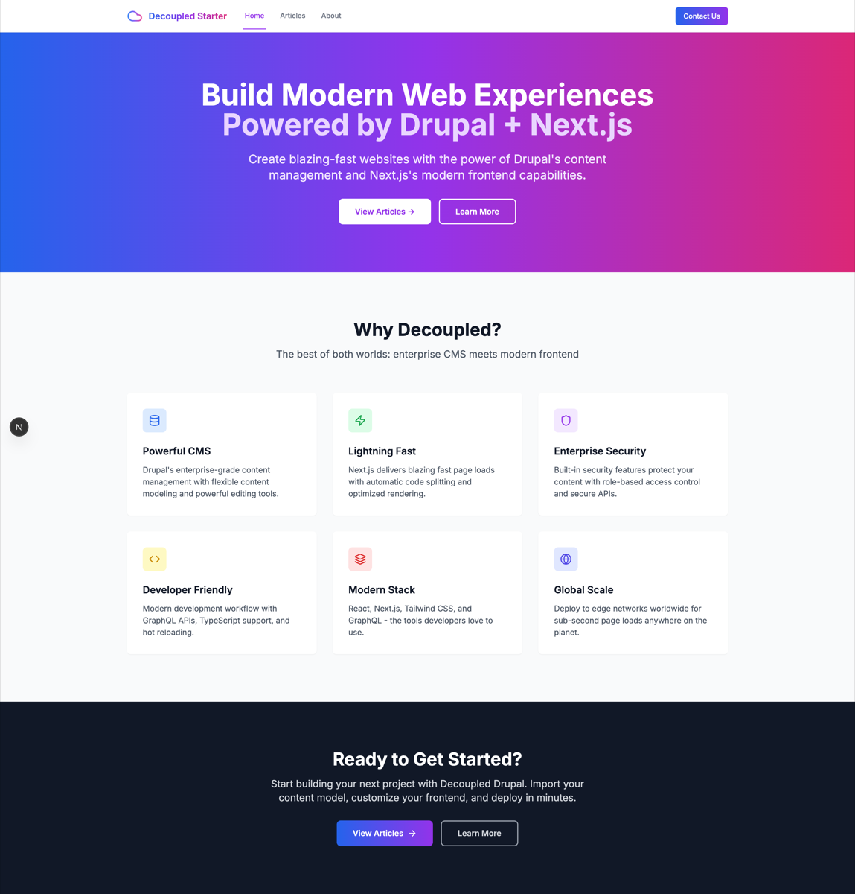

# Decoupled Restaurant

A restaurant website starter template for Decoupled Drupal + Next.js. Built for restaurants, cafes, bistros, and fine dining establishments.



## Features

- **Menu Items** - Showcase dishes and drinks with pricing, categories, dietary info, and photos
- **Events** - Promote special dinners, wine pairings, cooking classes, and seasonal events
- **Reviews** - Display customer testimonials with ratings and visit dates
- **Static Pages** - About, contact and reservations, and other content pages
- **Modern Design** - Clean, accessible UI optimized for restaurant and dining content

## Quick Start

### 1. Clone the template

```bash
npx degit nextagencyio/decoupled-restaurant my-restaurant
cd my-restaurant
npm install
```

### 2. Run interactive setup

```bash
npm run setup
```

This interactive script will:
- Authenticate with Decoupled.io (opens browser)
- Create a new Drupal space
- Wait for provisioning (~90 seconds)
- Configure your `.env.local` file
- Import sample content

### 3. Start development

```bash
npm run dev
```

Visit [http://localhost:3000](http://localhost:3000)

---

## Manual Setup

If you prefer to run each step manually:

<details>
<summary>Click to expand manual setup steps</summary>

### Authenticate with Decoupled.io

```bash
npx decoupled-cli@latest auth login
```

### Create a Drupal space

```bash
npx decoupled-cli@latest spaces create "My Restaurant"
```

Note the space ID returned. Wait ~90 seconds for provisioning.

### Configure environment

```bash
npx decoupled-cli@latest spaces env 1234 --write .env.local
```

### Import content

```bash
npm run setup-content
```

This imports:
- Homepage with hero, stats (15+ farm partners, 4.8 rating, 8 years, 200+ wines), and reservation CTA
- 6 menu items: Wood-Fired King Salmon, Dry-Aged Ribeye, Heirloom Tomato Salad, Wild Mushroom Flatbread, Apple Galette, Smoked Old Fashioned
- 3 events: Farm-to-Table Harvest Dinner, Winemaker's Dinner, Sunday Cooking Class
- 4 reviews from dinner, steak, vegetarian, and brunch guests
- 2 static pages: About Ember & Bloom, Contact & Reservations

</details>

## Content Types

### Menu Item
- **price**: Item price (e.g., "$38", "$22")
- **menu_category**: Category (Entrees, Starters, Desserts, Cocktails)
- **dietary_info**: Dietary labels (Vegetarian, Gluten-Free, etc.)
- **image**: Photo of the dish

### Event
- **event_date**: Date and time of the event
- **location**: Event venue or area (e.g., "Garden Dining Room")
- **image**: Event photo

### Review
- **reviewer_name**: Name of the reviewer
- **rating**: Star rating (1-5)
- **visit_date**: Date of the dining visit

### Homepage
- **hero_title**: Main headline (e.g., "Where Fire Meets Farm")
- **hero_subtitle**: Restaurant name tagline
- **hero_description**: Introductory paragraph
- **stats_items**: Key statistics (farm partners, rating, years, wine selections)
- **featured_items_title**: Section heading for featured dishes
- **cta_title / cta_description**: Reservation call-to-action block

### Basic Page
- General-purpose static content pages (About, Contact, etc.)

## Customization

### Colors & Branding
Edit `tailwind.config.js` to customize colors, fonts, and spacing.

### Content Structure
Modify `data/restaurant-content.json` to add or change content types and sample content.

### Components
React components are in `app/components/`. Update them to match your design needs.

## Demo Mode

Demo mode allows you to showcase the application without connecting to a Drupal backend.

### Enable Demo Mode

```bash
NEXT_PUBLIC_DEMO_MODE=true
```

### Removing Demo Mode

1. Delete `lib/demo-mode.ts`
2. Delete `data/mock/` directory
3. Delete `app/components/DemoModeBanner.tsx`
4. Remove `DemoModeBanner` from `app/layout.tsx`
5. Remove demo mode checks from `app/api/graphql/route.ts`

## Deployment

### Vercel (Recommended)
[](https://vercel.com/new/clone?repository-url=https://github.com/nextagencyio/decoupled-restaurant)

### Other Platforms
Works with any Node.js hosting platform that supports Next.js.

## Documentation

- [Decoupled.io Docs](https://www.decoupled.io/docs)
- [Next.js Documentation](https://nextjs.org/docs)
- [Drupal GraphQL](https://www.decoupled.io/docs/graphql)

## License

MIT
